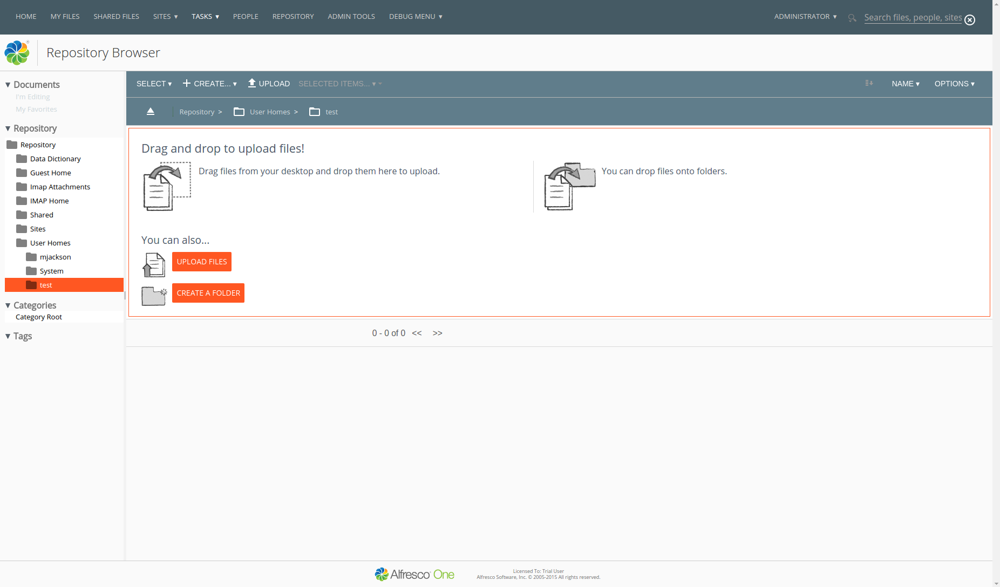

Alfresco 4.2.x Custom Theme 
===========================

#Introduction

This is a test to create a better UX for Alfresco 4.x and 5.x, where old YUI components are being given new style through
http://www.getmdl.io (Google Material Design) directives.

Some things to keep in mind:

- The theme *is not ready for production*, nor is complete.
- The only page currently working (and even that is still in testing) is the `/repository` page 
- There is no live demo available at the moment.
- Preview is available in the `screenshots` folder:

#Features:

- Prep for porting to Alfresco 5.x with LESS and CSS tokens (currently style is done through classic pre Alfresco 5.0.x `presentation.css`)
- Added support for `em` instead of fixed font size for some components for better readability
- Added Material Design by Google features (colors, flatness, fonts etc.)
- The color palette used can be found here: https://www.materialpalette.com/blue-grey/deep-orange
- Override of Alfresco Share Header style
- Removed a bunch of old images used as icons, now using Material icons in `.png` format (no svg support for now)
- New pagination style for improved readability
- New navbars for the `/repository` page
- Forced font-family Open Sans for most of the components (headers, navbars, tree views, category views, repository page, drag&drop component etc.)
- Changed footer styling

#Usage:

- Simply download the `target/alfresco-custom-theme.amp` file , copy it to `alfresco/amps_share` and install it as usual by running `apply_amps.sh` in your `alfresco/bin` folder.
- As said many things are broken, this is to be considered just a test.

#TODO

- Refactor all icons and images
- Grid/Responsive design
- Checkboxes
- Inputs
- Widgets
- Header Search box
- A lot of other stuff

#LICENSE
The MIT License (MIT)

Copyright (c) [2015] [Alen Subat]

Permission is hereby granted, free of charge, to any person obtaining a copy
of this software and associated documentation files (the "Software"), to deal
in the Software without restriction, including without limitation the rights
to use, copy, modify, merge, publish, distribute, sublicense, and/or sell
copies of the Software, and to permit persons to whom the Software is
furnished to do so, subject to the following conditions:

The above copyright notice and this permission notice shall be included in all
copies or substantial portions of the Software.

THE SOFTWARE IS PROVIDED "AS IS", WITHOUT WARRANTY OF ANY KIND, EXPRESS OR
IMPLIED, INCLUDING BUT NOT LIMITED TO THE WARRANTIES OF MERCHANTABILITY,
FITNESS FOR A PARTICULAR PURPOSE AND NONINFRINGEMENT. IN NO EVENT SHALL THE
AUTHORS OR COPYRIGHT HOLDERS BE LIABLE FOR ANY CLAIM, DAMAGES OR OTHER
LIABILITY, WHETHER IN AN ACTION OF CONTRACT, TORT OR OTHERWISE, ARISING FROM,
OUT OF OR IN CONNECTION WITH THE SOFTWARE OR THE USE OR OTHER DEALINGS IN THE
SOFTWARE.